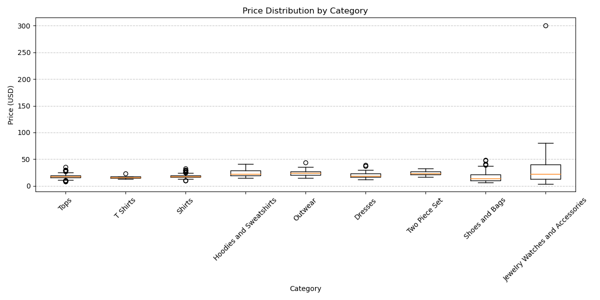
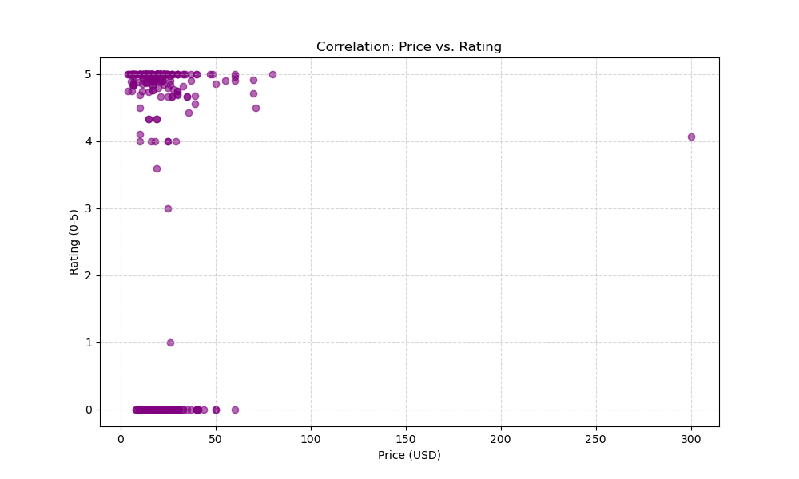
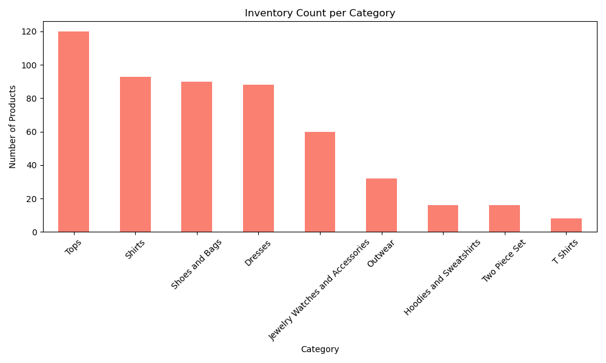
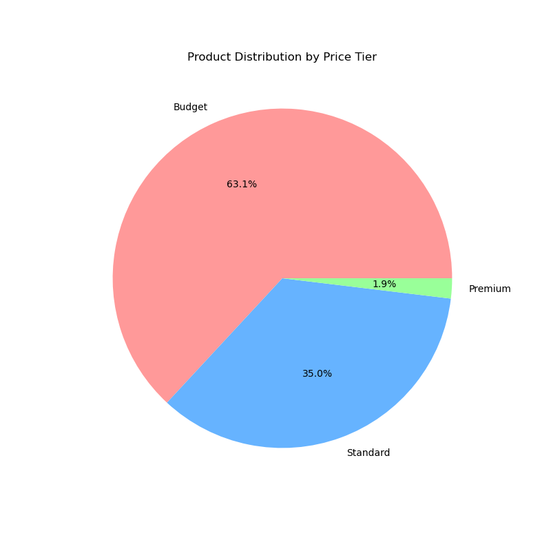
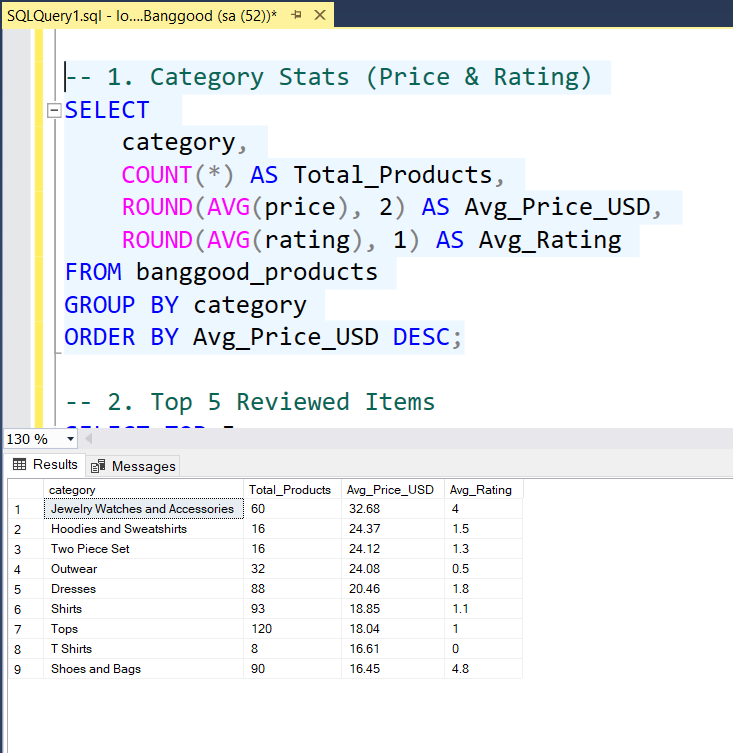
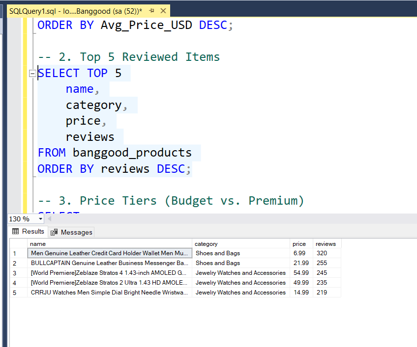
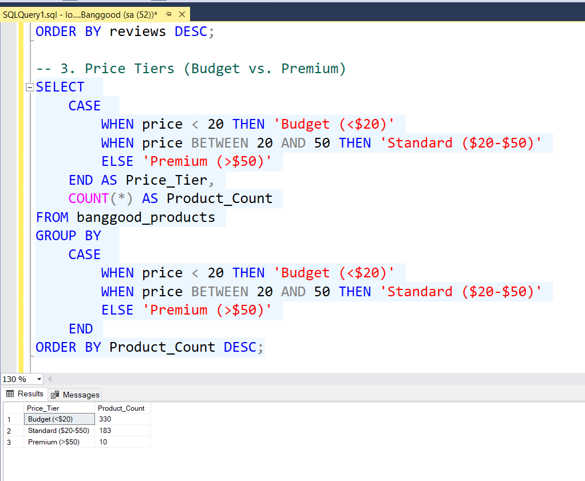
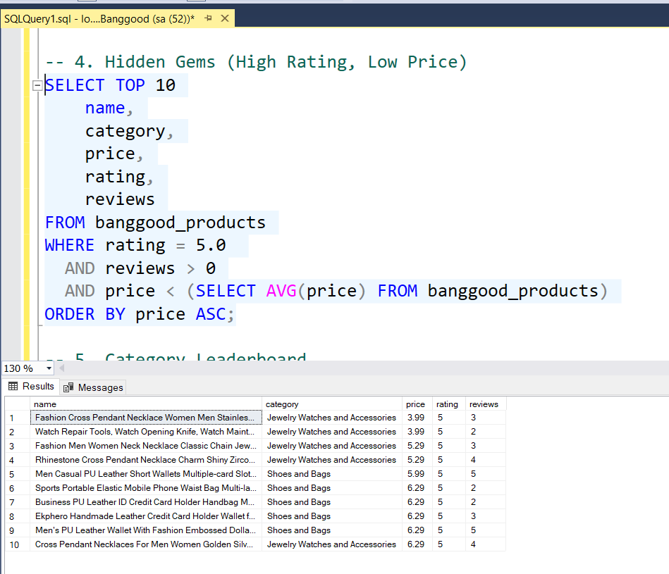
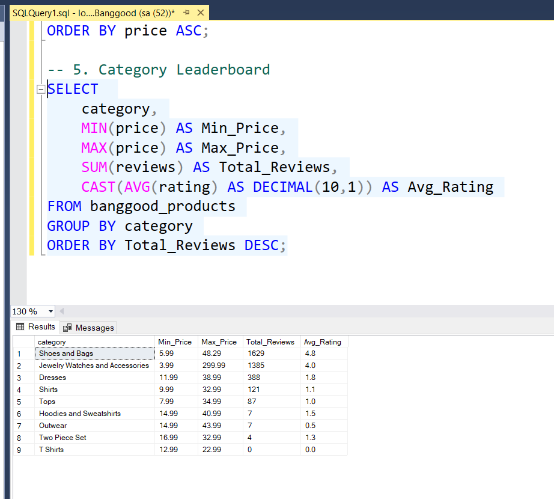

# 🛍️ Banggood E-Commerce Analytics Pipeline

**Course:** CDE Coding Night  
**Instructor:** Qasim Hassan  
**Author:** Muhammad Obaid Ullah Khan

---

## 1. Executive Summary

This project implements a Data Engineering pipeline to extract, process, and analyze product data from Banggood.com. The goal was to overcome modern anti-bot protections, structure unstructured web data, and derive actionable insights via SQL analysis.

**Key Result:** Successfully scraped, cleaned, and loaded 500+ product records across 10 categories into a production-grade SQL Server database.

---

## 2. Architecture Diagram

The system follows a standard ETL (Extract-Transform-Load) architecture.

**Data Flow:**

1.  **Source:** Banggood.com (Dynamic E-Commerce Site)
2.  **Extraction:** Python (Selenium + Undetected-Chromedriver)
3.  **Raw Storage:** CSV (`banggood_raw_data.csv`)
4.  **Transformation:** Python (Pandas) for cleaning and feature engineering.
5.  **Loading:** Microsoft SQL Server (Production Storage).
6.  **Analysis:** SQL Aggregation & Python Matplotlib Visualizations.

---

## 3. Methodology: Data Extraction

**Challenges:** Banggood uses web protection and dynamic JavaScript rendering, making standard requests scraping impossible.

**Solution:**

- Implemented `undetected-chromedriver` to mimic human browser fingerprints and bypass the "Access Denied" screen.
- Developed a custom pagination & scrolling logic to trigger lazy-loaded images and fetch 60+ products per page.
- Targeted 10 specific product categories (T-shirts, Women's Jewelry, Hoodies, etc.).

---

## 4. Data Cleaning & Transformation

Raw web data is messy. I built a cleaning module (`src/data_cleaning.py`) to standardize it.

**Key Steps:**

- **Price Normalization:** Removed currency symbols (US$, $) and converted strings to Float.
- **Review Parsing:** Extracted numeric counts from strings like "5 reviews".
- **Feature Engineering:**
  - `price_category`: Segmented items into Budget (<$20), Standard ($20-50), and Premium (>$50).
  - `is_popular`: Flagged items with >0 reviews and >4.5 rating.

---

## 5. 📊 Python Exploratory Analysis

Automated Python scripts generated visualizations to understand the dataset structure.

### Price Distribution per Category

_Most clothing items fall within the $15-$25 budget range._

### Rating vs. Price Correlation

_Analysis shows that higher prices do not guarantee higher ratings._

### Top 10 Most Reviewed Products

_Customer engagement is concentrated on a few viral items._

### Inventory Count per Category

_The "Tops" category has the highest number of listed items._

### Price Tier Distribution

_The inventory is heavily dominated by "Budget" and "Standard" items._

---

## 6. 🗄️ SQL Aggregated Insights

The final cleaned data was loaded into Microsoft SQL Server for deep analysis.

### 1. Category Statistics

_Aggregates average price and average rating per category to understand market positioning._

### 2. Top Reviewed Items

_Identifies the viral products (Top 5) that drive the most customer engagement._

### 3. Price Tier Analysis

_Classifies inventory into Budget, Standard, and Premium segments to analyze stock distribution._

### 4. Hidden Gems

_Queries products with perfect 5.0 ratings but low visibility (low review counts) or low price points._

### 5. Category Leaderboard

_Ranks categories based on total inventory volume and popularity._

---

## 7. Conclusion & Recommendations

### Key Findings
- **Budget Dominance:** The platform heavily favors budget shoppers, with the vast majority of inventory priced between **$15 and $25**.
- **Viral Skew:** Customer engagement is highly concentrated; a small number of "viral" products capture most reviews, while the "long tail" of inventory remains unreviewed.
- **Price ≠ Quality:** Data shows no strong correlation between higher prices and better ratings, suggesting **value-for-money** is the key driver of satisfaction.

### Recommendations
- **Pricing Strategy:** Sellers should target the **$15-$20 sweet spot** for new product launches to maximize volume and visibility.
- **Engagement Focus:** Aggressively incentivize the first 5 reviews for new listings, as unreviewed products struggle to gain organic traction.
- **Opportunity:** Market **"Hidden Gems"** (5.0-rated budget items) to value-conscious buyers who may be overlooking high-quality, low-cost options.
